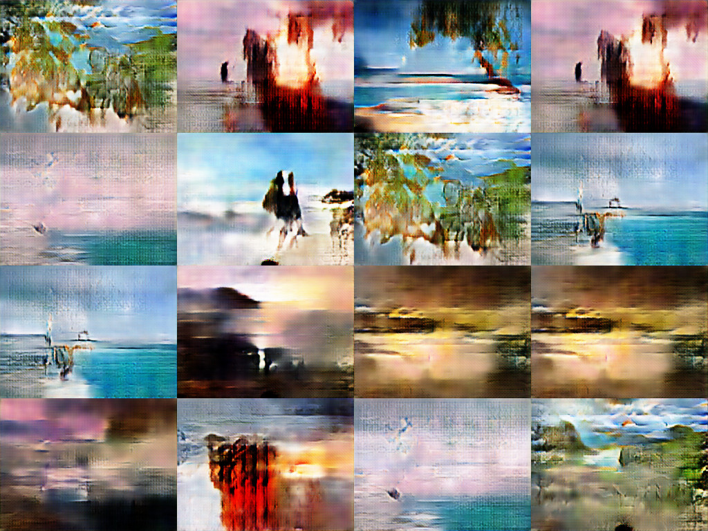

# RectGAN
The World's First Generative Adversarial Network that generates rectangular images.  Loosely based off of the [Keras-GAN-Animeface-Character](https://github.com/forcecore/Keras-GAN-Animeface-Character).

This is still a work in progress and many essential features are not supported and/or not adhering to best practices for GANs.  I'm no expert in GANs, but I've merely created RectGAN to make it easier to work with training and generating rectangular images, since the vast majority of image data that I have is in that format.

## Example:

I downloaded about 500 horizontal images of beaches [from Pixabay.com](http://pixabay.com), resized them all to 256x192, and trained my GAN for about 37,100 epochs to arrive at the following collage:



Although they're nowhere near the [photo-quality faces that Nvidia generated](https://research.nvidia.com/publication/2017-10_Progressive-Growing-of), it's by far the best I've been able to generate on my 4 GB Geforce GTX 960M using only about 500 images and training for roughly 24 hours.

## Running:

- Install dependencies (Keras, Tensorflow, Scipy, etc)
- Clone the repository
- Edit the parameters (in args.py).  Important ones include:
  - **data_dir**: location of the training images for your GAN.  Right now, they must be in .JPG format but other formats will be supported in the future.
  - **w and h**: width and height that the image should be resized to.  See the comments for valid width and height combos.
- Generate data.hdf5: after editing args.py, you should run ```python data.py``` to generate data.hdf5.
- Train the GAN: simply run the following: ```python gan.py``` and watch the images appear in the **anim** directory (or whatever directory you set in args.py)
- If you stopped the training and want to restart, run the following: ```python -c "import gan; gan.train_gan('data.hdf5', 1000000, 20, True)" and training will resume, but the numbering of the images generated in the destination folder will reset.

## Further Aspirations:

- A better optimized architecture
- Inputting settings from a GUI
- Implementing the neural networks in Pytorch instead of Keras